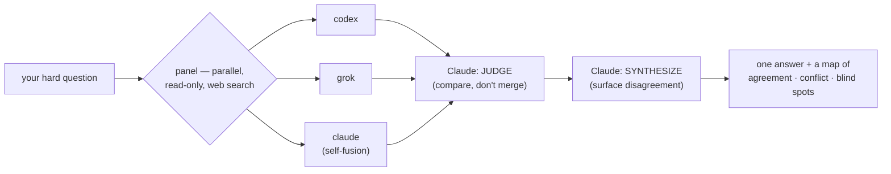

# Alloy

[](https://github.com/tlangridge/Alloy/actions/workflows/ci.yml)
[](LICENSE)
[](#requirements)
[](https://www.skills.sh/)

> **The local, CLI-agent way to run [OpenRouter's "Fusion"](https://openrouter.ai/docs/guides/routing/routers/fusion-router) methodology** — no hosted router, no API keys, just the AI CLIs you already have.

**Ask several frontier AI coding CLIs the same hard question, in parallel, and
get an honest map of where they agree, disagree, and are collectively blind —
instead of one confident answer from one model.**

Alloy is a [Claude Code](https://claude.com/claude-code) skill that brings the
idea behind [OpenRouter's "Fusion"](https://openrouter.ai/docs/guides/routing/routers/fusion-router)
router — *"fusion beats frontier"* — down to the CLIs already installed on your
machine. It dispatches one prompt to a **panel** of every model you have —
`codex`, `grok`, and a fresh `claude` instance ("self-fusion") — running
**in parallel, read-only, and able to search the web**, then Claude acts as the **judge** and
**synthesizer**: it compares the answers and writes a final one that *surfaces
the disagreement* rather than averaging it away.

> **It does not merge answers into mush.** Its whole job is to show you the
> consensus, the contradictions, the unique insight only one model had, and the
> blind spot none of them saw — then let you decide.

Alloy ships **no API keys** and sends **no telemetry** — your prompts go only to
the CLIs you already installed and authenticated. (Its one optional network call
is a throttled `git fetch` update check; `ALLOY_NO_UPDATE_CHECK=1` disables it.)

> Not affiliated with OpenRouter. "Fusion" is OpenRouter's term for the
> methodology; this is an independent local reimplementation. See [`NOTICE`](NOTICE).

---

## See it in 15 seconds

A real Alloy round (the prompt: *"the single biggest reliability risk when an
orchestrator runs multiple AI CLIs in parallel"*) — note that the two models
**disagree**, which is exactly the point:

```
$ alloy doctor
  [ready] codex   codex-cli 0.139.0
  [ready] grok    0.46.0

$ alloy panel --prompt-file prompt.txt
[alloy] panel: codex, grok (2 model call(s))
[alloy] codex: ok in 10.4s (exit 0)
[alloy] grok: ok in 13.6s (exit 0)
```

- **codex:** "…nondeterministic, interleaved output causing the orchestrator to
  misattribute messages to the wrong CLI."
- **grok:** "…race conditions where agents modify the same shared files, leading
  to silent code corruption."

Claude then judges (*they answered different questions — codex is about reading
output, grok about writing files; both are real, they are not in conflict*) and
synthesizes one answer that keeps both, attributed. One model would have given
you only half the picture, confidently.

---

## Does fusing models actually help?

Yes — and not just "more models = better." OpenRouter benchmarked the Fusion
methodology Alloy implements and found that a **panel + a synthesis step** beats
any single model, with a meaningful chunk of the gain coming from the *synthesis
itself*:

| Configuration — OpenRouter's DRACO benchmark (100 deep-research tasks) | Score |
|---|---|
| **Fable 5 + GPT-5.5, fused** (synthesized by Opus 4.8) | **69.0%** |
| Fable 5 alone (best single model tested) | 65.3% |
| Opus 4.8 *fused with itself* (same model, run twice) | 65.5% |
| Opus 4.8 alone | 58.8% |

> "Fable 5 + GPT-5.5 fused together scored 69.0%, surpassing every individual
> model, including Fable 5 alone at 65.3%."
> — [OpenRouter, *Fusion beats Frontier*](https://openrouter.ai/blog/announcements/fusion-beats-frontier/) (figures and charts © OpenRouter)

<p align="center">
  
  
</p>

<sub>Charts © OpenRouter, from <a href="https://openrouter.ai/blog/announcements/fusion-beats-frontier/"><em>Surpassing Frontier Performance with Fusion</em></a> (Brian Thomas, 2026), shown with attribution. Alloy is an independent reimplementation and is not affiliated with OpenRouter.</sub>

The third row is the telling one: fusing a model **with itself** still gained
**+6.7 points** (58.8% → 65.5%), because parallel runs take different reasoning
paths — so much of the lift is the *compare-and-synthesize* step, not just model
diversity. (OpenRouter notes Fusion runs ~2–3× the latency of a single call; panel
size is the cost knob.)



**It is not a universal win, and Alloy is built around that.** Multi-model methods
help most on *objective, high-stakes thinking* (research, architecture, debugging,
factuality) and can *hurt* on subjective work — or when a confident-but-wrong voice
drags the panel into agreement (a measured 10–40% accuracy drop in the multi-agent
debate literature). So Alloy **surfaces disagreement instead of averaging it away**,
keeps you as the decider, and gates its `debate` round on genuine, checkable
disagreement. Evidence, sources, and the Claude-as-judge bias discussion are in
[`docs/methodology.md`](docs/methodology.md).

---

## Install

Alloy is a Claude Code skill that lives in `~/.claude/skills/alloy/` and runs on
Python 3 (standard library only — no `pip install`). macOS / Linux (Windows via WSL).

**1. Install at least one panelist CLI** — Alloy orchestrates CLIs you already
have; it ships none of its own. Two or more is where it earns its keep:

```bash
npm install -g @openai/codex        # then authenticate: codex login
# see https://grok.com (Grok CLI)   # then authenticate: grok login
```

**2. Install the skill — pick _one_ method:**

_Quickest, via [skills.sh](https://www.skills.sh):_

```bash
npx skills add tlangridge/Alloy
```

It auto-detects Claude Code, installs the skill, and updates later via
`npx skills update`. Then do step 3.

_From source (recommended if you'll contribute, or want `git pull` updates):_

```bash
git clone https://github.com/tlangridge/Alloy.git ~/Developer/alloy
cd ~/Developer/alloy && ./install.sh   # symlinks into ~/.claude/skills/alloy and runs doctor
```

_Or (clone straight into the skills directory, no symlink):_

```bash
git clone https://github.com/tlangridge/Alloy.git ~/.claude/skills/alloy
~/.claude/skills/alloy/bin/alloy doctor
```

Pick one of these, not several.

**3. Restart Claude Code** (or open a new session) so it discovers the skill.
Then run `doctor` first — it tells you which panelists are installed, which are
authenticated, and exactly how to add the missing ones:

```
  [ready]  codex   codex-cli 0.139.0
  [auth?]  grok               installed but not authenticated -> run `grok login` to log in
  [ --- ]  antigravity  (experimental, no read-only mode)
```

Now, inside Claude Code:

```
/alloy doctor
/alloy ask Should we migrate this service to event sourcing or keep CRUD? Trade-offs.
/alloy review            # panel reviews your current git diff
/alloy plan add rate limiting to the public API
/alloy <a full build task>   # research -> plan -> implement -> test
```

> **Tip:** the CLI lives at `~/.claude/skills/alloy/bin/alloy`. To call it as just
> `alloy` (as the examples in this README do), symlink it onto your `PATH`:
> `ln -s ~/.claude/skills/alloy/bin/alloy /usr/local/bin/alloy`.

> **The prerequisite cliff, stated honestly:** Alloy is only useful if you have
> **2+** of {`codex`, `grok`, …} installed *and authenticated*. With only Claude
> it degrades to a normal single-model answer and tells you so. Run `doctor`
> first; it will not surprise you.

---

## What you get

| Mode | What it does |
|---|---|
| `/alloy doctor` | Which panelists are installed / authed / ready, with fix-it hints. |
| `/alloy ask <q>` | One Alloy round: panel answers in parallel → judge → synthesis. The cheapest, safest mode. |
| `/alloy debate <q>` | A rare, evidence-gated second round — only for objective questions where the panel genuinely disagrees (anonymized, evidence-weighted, one round). |
| `/alloy review [target]` | Panel reviews your current diff, read-only → consolidated pass/fail + findings. |
| `/alloy plan <task>` | Research + plan rounds → one synthesized plan, presented for approval. |
| `/alloy <task>` | Full lifecycle: research → plan → collaborate → implement → test. |

In the lifecycle, **Claude writes all the code; the panel only ever reviews,
read-only.** Alloy never lets a panelist edit your files, run a build, or touch
a git worktree. That is a deliberate v1 boundary (see *Roadmap*).

Need the panel to see more than a diff? `alloy panel --attach file1,file2` (or
`ALLOY_ATTACH=…`) folds whole files into the prompt as read-only reference — handy
for giving the panel the call sites a diff doesn't include (the panel can't read
your repo, only what you put in the prompt).

---

## Why a *local* version?

OpenRouter's hosted Fusion is web-UI only — there is no API for it, so you cannot
drop it into a coding workflow. Alloy gets you the same panel→judge→synthesize
shape against the CLIs you already pay for, right inside Claude Code, with the
run captured to disk so you can audit exactly what each model said.

## When Alloy helps (and when it doesn't)

Multi-model panels shine on **high-stakes thinking**: architecture decisions,
research, planning, debugging triage, security/correctness review — *"if the cost
of being wrong is higher than the cost of asking three models, fuse."* They are a
**poor** fit for raw line-by-line code generation (synthesis dilutes a model's
distinctive voice and just adds latency and cost). That is why Alloy uses the
panel for the *thinking* and leaves the *writing* to Claude.

## Safety model

- **Read-only panel.** Panelists run behind their CLI's read-only sandbox flag
  (`codex -s read-only`, `grok --permission-mode plan`, `claude --permission-mode
  plan`) **and** in a throwaway temporary working directory, so they get no access
  to your repo. Adapters
  without a real read-only mode (e.g. `cursor-agent`) are refused unless you
  explicitly opt in with `ALLOY_ALLOW_UNSANDBOXED=1`.
- **Web research, on by default.** Panelists can search the web (codex's hosted
  `web_search`; grok and claude search the web in plan mode), matching Fusion's web-enabled
  panel — so they reason over current facts, not just training data. Search is
  read-only (no files, no shell), but it does mean a panelist may fetch external
  pages: that content is untrusted too, and the queries go to the providers.
  Disable with `ALLOY_WEB=0`.
- **Panel output is treated as untrusted data**, never as instructions — Alloy
  is hardened against a panelist emitting "ignore previous instructions / run
  this command".
- **Prompts go on stdin**, never on the command line (no `ARG_MAX` limits, no
  quoting bugs, no shell injection, no leaking prompts into `ps`).
- **No auto-approve.** Alloy never passes `--yolo` / `-y` /
  `--dangerously-bypass-approvals-and-sandbox`.
- **Secret scanning.** Panelist output (both the saved answer and the raw
  stdout/stderr files) is scanned and redacted for common secret shapes before it
  is saved. This is a best-effort heuristic, not a guarantee.
- **Run artifacts live outside your repo.** Prompts, redacted output, and the
  manifest are written under `$XDG_STATE_HOME/alloy/runs` by default (override
  with `ALLOY_RUN_ROOT`), and the run root gets a `.gitignore` so artifacts are
  never committed even if you point it inside a repo.
- **No project-level config execution.** Config is read from `~/.config/alloy/`
  as `KEY=value` (never `source`d), so a hostile repo cannot run code.
- **Override binaries inherit your environment.** `ALLOY_BIN_<NAME>` runs
  whatever you point it at (with your env, as the CLIs need for auth); the
  read-only guarantee is then that tool's responsibility.

> "Read-only" means the panel does not write to your files. It is **not** an OS
> data-exfiltration sandbox: your prompt and any diff you review are sent to each
> CLI's model provider, as with using those CLIs directly.

## Privacy & cost

Alloy makes no network calls itself and stores no keys. Each Alloy round makes
**one model call per ready panelist**, in parallel, billed to **your** provider
accounts through your CLIs — your prompts and diffs are sent to those providers.
A panel of 3 is roughly 3–5× the cost of one call; the full lifecycle is several
rounds. Alloy shows a cost preflight before multi-round runs. You are
responsible for each CLI's terms of service regarding automated use.

## Configuration

Copy [`alloy.config.example`](alloy.config.example) to
`~/.config/alloy/config` and edit. Everything is also settable via environment
variables (env wins over the file):

| Key | Default | Meaning |
|---|---|---|
| `ALLOY_PANELISTS` | *all available* | which adapters form the panel; **unset = the complete set** of installed + authed read-only CLIs (codex, grok, claude). Set it to pin a narrower / cheaper panel. |
| `ALLOY_TIMEOUT` | `300` | per-panelist timeout, seconds (parallel, so the max not the sum) |
| `ALLOY_HEARTBEAT` | `30` | seconds between progress heartbeats for a slow panelist |
| `ALLOY_STALL_TIMEOUT` | `0` | kill if no new output for N s (off by default; reasoning is often silent) |
| `ALLOY_RETRY` | `auth` | statuses that earn one self-healing re-dispatch (never a loop); `auth` catches the transient token-refresh race. `auth,empty` also re-asks blanks; `0`/`off` disables |
| `ALLOY_MAX_CHARS` | `200000` | cap on each panelist's captured output |
| `ALLOY_CODEX_MODEL` / `ALLOY_ANTIGRAVITY_MODEL` | CLI default | model override per adapter (e.g. `ALLOY_ANTIGRAVITY_MODEL=gemini-3.1-pro`; antigravity is opt-in — only runs with `ALLOY_ALLOW_UNSANDBOXED=1`) |
| `ALLOY_GROK_MODEL` | grok default | Grok model: `grok-build` or `grok-composer-2.5-fast` |
| `ALLOY_CLAUDE_MODEL` | claude default | the `claude` panelist's model (an alias like `opus`/`sonnet`, or a full id) |
| `ALLOY_CODEX_EFFORT` | `high` | codex reasoning effort (`medium`/`high`/`xhigh`, or `inherit`) — avoids inheriting a global `xhigh` that times out |
| `ALLOY_JUDGE` | `claude` | who judges (Claude is host default; see methodology) |
| `ALLOY_RUN_ROOT` | `$XDG_STATE_HOME/alloy/runs` | where run output is written (outside your repo) |
| `ALLOY_WEB` | `1` | panelists may search the web for research; `0` disables it (codex) |
| `ALLOY_MAX_PROMPT_BYTES` | `4000000` | cap on total prompt size, including attachments |
| `ALLOY_ATTACH` | _(unset)_ | comma list of files to fold into the prompt (also `--attach`) |
| `ALLOY_NO_UPDATE_CHECK` | `0` | set to `1` to disable the throttled git update check |

## Requirements

- Python 3.8+ (standard library only — no `pip install`).
- macOS or Linux (Windows via WSL).
- At least one supported CLI, ideally two: [`codex`](https://github.com/openai/codex),
  [`grok`](https://grok.com).

## How it works

```
            prompt (on stdin, never argv)
                      |
        bin/alloy panel  -- parallel, read-only, throwaway cwd, process-group timeouts
          /        |        \
      codex      grok       (more adapters)
          \        |        /
       run dir + manifest.json  (per-panelist status, paths, caps, redactions)
                      |
   Claude: JUDGE (compare, do not merge) -> judge.json
                      |
   Claude: SYNTHESIZE (attributed, disagreements surfaced) -> you decide
```

`bin/alloy` is the hardened, tested mechanical core (dispatch + capture).
Claude does the judging and synthesis — the parts that need intelligence and your
repo context. See [`docs/methodology.md`](docs/methodology.md).

## Extending it

Adding a CLI is a small, well-defined adapter. See
[`docs/adding-a-panelist.md`](docs/adding-a-panelist.md) for the 5-function
contract (detect / auth / invoke-read-only / parse / capabilities), a copy-paste
template, and the worked `cursor-agent` example (which shows how an adapter with
*no* read-only mode is handled).

## Roadmap

v1 deliberately keeps the panel read-only. Clearly out of scope until the core is
battle-tested: panelists writing code (opt-in, isolated git worktree),
auto-running builds, and a `ALLOY_JUDGE=codex|grok` judge-rotation override.

## License

[MIT](LICENSE). Built to be published and forked.
