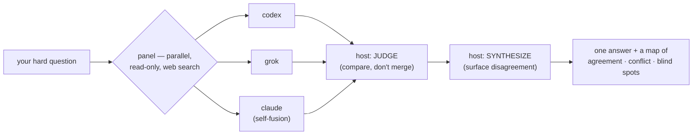

# Alloy

[](https://github.com/tlangridge/Alloy/actions/workflows/ci.yml)
[](LICENSE)
[](#requirements)
[](https://www.skills.sh/)

> **The local, CLI-agent way to run [OpenRouter's "Fusion"](https://openrouter.ai/docs/guides/routing/routers/fusion-router) methodology** — using the AI CLIs you already have, with optional Jev task routing.

**Ask several frontier AI coding CLIs the same hard question, in parallel, and
get an honest map of where they agree, disagree, and are collectively blind —
instead of one confident answer from one model.**

Alloy is a skill for [Claude Code](https://claude.com/claude-code),
[Codex](https://github.com/openai/codex), [Grok](https://grok.com), Gemini CLI,
Antigravity (`agy`), and any host that can run a local skill. It brings the
idea behind [OpenRouter's "Fusion"](https://openrouter.ai/docs/guides/routing/routers/fusion-router)
router — *"fusion beats frontier"* — down to the CLIs already installed on your
machine. It dispatches one prompt to a **panel** of every model you have —
`codex`, `grok`, a fresh `claude` instance, and Antigravity/Gemini — running
**in parallel, read-only inside your repo, and able to search the web**, then
the **host** (whoever invoked `/alloy`) acts as the **judge** and
**synthesizer**: it compares the answers and writes a final one that *surfaces
the disagreement* rather than averaging it away.

> **It does not merge answers into mush.** Its whole job is to show you the
> consensus, the contradictions, the unique insight only one model had, and the
> blind spot none of them saw — then let you decide.

Alloy sends **no telemetry**. Regular panels use your authenticated CLIs.
Optional **Jev routing** sends task text to TypeSafe or OpenRouter using your key; model discovery
queries CLI providers. The stable-release auto-updater can be disabled with
`ALLOY_NO_UPDATE_CHECK=1`. See [routing setup and cost controls](docs/routing.md).

> Not affiliated with OpenRouter. "Fusion" is OpenRouter's term for the
> methodology; this is an independent local reimplementation. See [`NOTICE`](NOTICE).

---

## Route a task with Jev

```sh
./install.sh --setup
alloy route --prompt-file task.txt         # choose a model; JSON output
alloy panel --route --prompt-file task.txt # choose and run one read-only model
alloy models refresh                      # discover available models
alloy models advise                       # evidence, strengths and profile suggestions
alloy usage                               # subscription capacity meters
# In your agent: /alloy-usage
```

The guided setup detects Codex, Claude, Grok and Antigravity (`agy`), accepts your
Jev key and records how each CLI is billed. Profiles are configurable as models
change. Existing model pins remain binding. See [the routing guide](docs/routing.md)
for setup, catalog updates, cost assumptions and independent Maker/Checker use.
[Subscription meters](docs/usage.md) show fresh remaining capacity and reset times,
and feed quota reserves and headroom into routing.
[Model research](docs/model-research.md) informs task-specific recommendations
within a bounded cost tolerance.

## See it in 15 seconds

A real Alloy round (the prompt: *"the single biggest reliability risk when an
orchestrator runs multiple AI CLIs in parallel"*) — note that the two models
**disagree**, which is exactly the point:

```
$ alloy doctor
  [ready] codex   codex-cli 0.139.0
  [ready] grok    0.46.0

$ alloy panel --prompt-file prompt.txt
[alloy] panel: codex, grok (2 model call(s))
[alloy] codex: ok in 10.4s (exit 0)
[alloy] grok: ok in 13.6s (exit 0)
```

- **codex:** "…nondeterministic, interleaved output causing the orchestrator to
  misattribute messages to the wrong CLI."
- **grok:** "…race conditions where agents modify the same shared files, leading
  to silent code corruption."

The host then judges (*they answered different questions — codex is about reading
output, grok about writing files; both are real, they are not in conflict*) and
synthesizes one answer that keeps both, attributed. One model would have given
you only half the picture, confidently.

---

## Does fusing models actually help?

Yes — and not just "more models = better." OpenRouter benchmarked the Fusion
methodology Alloy implements and found that a **panel + a synthesis step** beats
any single model, with a meaningful chunk of the gain coming from the *synthesis
itself*:

| Configuration — OpenRouter's DRACO benchmark (100 deep-research tasks) | Score |
|---|---|
| **Fable 5 + GPT-5.5, fused** (synthesized by Opus 4.8) | **69.0%** |
| Fable 5 alone (best single model tested) | 65.3% |
| Opus 4.8 *fused with itself* (same model, run twice) | 65.5% |
| Opus 4.8 alone | 58.8% |

> "Fable 5 + GPT-5.5 fused together scored 69.0%, surpassing every individual
> model, including Fable 5 alone at 65.3%."
> — [OpenRouter, *Fusion beats Frontier*](https://openrouter.ai/blog/announcements/fusion-beats-frontier/) (figures and charts © OpenRouter)

<p align="center">
  
  
</p>

<sub>Charts © OpenRouter, from <a href="https://openrouter.ai/blog/announcements/fusion-beats-frontier/"><em>Surpassing Frontier Performance with Fusion</em></a> (Brian Thomas, 2026), shown with attribution. Alloy is an independent reimplementation and is not affiliated with OpenRouter.</sub>

The third row is the telling one: fusing a model **with itself** still gained
**+6.7 points** (58.8% → 65.5%), because parallel runs take different reasoning
paths — so much of the lift is the *compare-and-synthesize* step, not just model
diversity. (OpenRouter notes Fusion runs ~2–3× the latency of a single call; panel
size is the cost knob.)


```mermaid
flowchart LR
  Q["your hard question"] --> P{"panel — parallel,<br/>read-only, web search"}
  P --> C["codex"]
  P --> K["grok"]
  P --> CL["claude<br/>(self-fusion)"]
  C --> J["host: JUDGE<br/>(compare, don't merge)"]
  K --> J
  CL --> J
  J --> S["host: SYNTHESIZE<br/>(surface disagreement)"]
  S --> A["one answer + a map of<br/>agreement · conflict · blind spots"]
```

**It is not a universal win, and Alloy is built around that.** Multi-model methods
help most on *objective, high-stakes thinking* (research, architecture, debugging,
factuality) and can *hurt* on subjective work — or when a confident-but-wrong voice
drags the panel into agreement (a measured 10–40% accuracy drop in the multi-agent
debate literature). So Alloy **surfaces disagreement instead of averaging it away**,
keeps you as the decider, and gates its `debate` round on genuine, checkable
disagreement. Evidence, sources, and the host-as-judge bias discussion are in
[`docs/methodology.md`](docs/methodology.md).

---

## Install

Alloy is a skill that lives in `~/.claude/skills/alloy/` — and, after
`install.sh`, in the skill directory of every other host it finds:
`~/.codex/skills/` (Codex), `~/.grok/skills/` (Grok), and
`~/.gemini/config/skills/` (Antigravity / `agy`) — as three links
per host: `alloy`, `alloy-execute`, and `alloy-usage`. It runs on Python 3 (standard
library only — no `pip install`). macOS / Linux (Windows via WSL).

**1. Install at least one panelist CLI** — Alloy orchestrates CLIs you already
have; it ships none of its own. Two or more is where it earns its keep:

```bash
npm install -g @openai/codex        # then authenticate: codex login
# see https://grok.com (Grok CLI)   # then authenticate: grok login
```

**2. Install the skill — pick _one_ method:**

_Quickest, via [skills.sh](https://www.skills.sh):_

```bash
npx skills add tlangridge/Alloy
```

It auto-detects Claude Code, installs the skill, and updates later via
`npx skills update`. Then do step 3.

_From source (recommended if you'll contribute, or want `git pull` updates):_

```bash
git clone https://github.com/tlangridge/Alloy.git ~/Developer/alloy
cd ~/Developer/alloy && ./install.sh   # symlinks into ~/.claude/skills/alloy and runs doctor
```

_Or (clone straight into the skills directory, no symlink):_

```bash
git clone https://github.com/tlangridge/Alloy.git ~/.claude/skills/alloy
~/.claude/skills/alloy/bin/alloy doctor
```

Pick one of these, not several.

**3. Restart your host CLI** (Claude Code, Codex, Grok, Gemini CLI, or `agy` —
or open a new session) so it discovers the skill. Then run `doctor` first — it tells you which panelists are installed,
which are authenticated, and exactly how to add the missing ones:

```
  [ready]  codex   codex-cli 0.139.0
  [auth?]  grok               installed but not authenticated -> run `grok login` to log in
  [ready]  antigravity  1.1.7
  [no-ro]  opencode  (experimental, no read-only mode)  1.18.3
```

Now, inside Claude Code:

```
/alloy doctor
/alloy ask Should we migrate this service to event sourcing or keep CRUD? Trade-offs.
/alloy review            # panel reviews your current git diff
/alloy plan add rate limiting to the public API
/alloy execute fix the login redirect so expired sessions land on /signin
/alloy-execute the auth cookie is ignored on safari     # same as `/alloy execute`
/alloy <a full build task>   # research -> plan -> implement -> test
```

> **Tip:** the CLI lives at `~/.claude/skills/alloy/bin/alloy`. To call it as just
> `alloy` (as the examples in this README do), symlink it onto your `PATH`:
> `ln -s ~/.claude/skills/alloy/bin/alloy /usr/local/bin/alloy`.

> **The prerequisite cliff, stated honestly:** Alloy is only useful if you have
> **2+** of {`codex`, `grok`, `claude`, …} installed *and authenticated*. With
> only the host it degrades to a normal single-model answer and tells you so.
> Run `doctor` first; it will not surprise you.

---

## What you get

| Mode | What it does |
|---|---|
| `/alloy doctor` | Which panelists are installed / authed / ready, with fix-it hints. |
| `/alloy ask <q>` | One Alloy round: panel answers in parallel → judge → synthesis. The cheapest, safest mode. |
| `/alloy debate <q>` | A rare, evidence-gated second round — only for objective questions where the panel genuinely disagrees (anonymized, evidence-weighted, one round). |
| `/alloy review [target]` | Panel reviews your current diff, read-only → consolidated pass/fail + findings. |
| `/alloy plan <task>` | Research + plan rounds → one synthesized plan, presented for approval. |
| `/alloy execute <task>` (alias `/alloy-execute <task>`) | **Managed Maker/Checker loop.** An efficient other-family Maker edits and tests in an owned worktree; an independent Checker reviews; Alloy handles up to two correction rounds. The host judges and integrates, with automatic cleanup after verified integration. |
| `/alloy <task>` | Full lifecycle: research → plan → collaborate → implement → test. |

Consult/review panels stay read-only. In managed `execute`, the Maker writes
and tests in an isolated Git worktree while the Checker stays read-only. Alloy
handles correction rounds and returns a compact host handoff. The host judges
and integrates with `alloy integrate`; successful integration removes the owned
worktree and branch. Failed or interrupted work is retained. Worktrees provide
workflow isolation, not an OS security boundary. [Execution guide](docs/execution.md).

The panel reads the repo itself, so you rarely need to spoon-feed files. When you
*do* want to force specific files into the prompt (e.g. something outside the
repo, or to guarantee a file is seen), `alloy panel --attach file1,file2` (or
`ALLOY_ATTACH=…`) folds them in as read-only reference. Use `--no-repo` to run
the panel with no repo access at all (pure web research / maximum caution).

---

## Why a *local* version?

OpenRouter's hosted Fusion is web-UI only — there is no API for it, so you cannot
drop it into a coding workflow. Alloy gets you the same panel→judge→synthesize
shape against the CLIs you already pay for, right inside Claude Code, with the
run captured to disk so you can audit exactly what each model said.

## When Alloy helps (and when it doesn't)

Multi-model panels shine on **high-stakes thinking**: architecture decisions,
research, planning, debugging triage, security/correctness review — *"if the cost
of being wrong is higher than the cost of asking three models, fuse."* They are a
**poor** fit for raw line-by-line code generation (synthesis dilutes a model's
distinctive voice and just adds latency and cost). That is why Alloy uses the
panel for comparing ideas. Managed `execute` delegates implementation and
testing to one efficient Maker. A separate
model family challenges the result against the spec; the same Maker handles
corrections before the host receives the result.

## Safety model

- **Read-only panel that can read your repo.** By default the panel runs in your
  **real working tree** (auto-detected git root) so panelists can ground coding
  answers in your actual code — including uncommitted edits. Writes are prevented
  by each CLI's read-only flag (`codex -s read-only`, `grok`/`claude
  --permission-mode plan`) — **best-effort, the CLIs' own enforcement, not an OS
  sandbox**; a tamper tripwire fingerprints the tree before/after and shouts if it
  changed. Turn it off with `--no-repo` / `ALLOY_REPO=none` (empty throwaway cwd),
  or point elsewhere with `--repo`. Adapters with no read-only mode (`cursor-agent`,
  `opencode`) are refused unless you set `ALLOY_ALLOW_UNSANDBOXED=1` — and even
  then they get a **disposable copy** of the repo, never your real tree.
- **Antigravity (`agy`) is read-only by allow-list.** agy ignores the process cwd
  and has no read-only flag, so it is contained differently: alloy generates a
  settings file that allow-lists **read tools only** (agy >= 1.1 auto-denies
  anything unlisted in headless mode — verified: `write_file` and `command` both
  fail closed), points agy at an **alloy-owned HOME** so those settings are ours
  and its scratch/conversation state stays out of `~/.gemini`, and grants your
  repo explicitly with `--add-dir`. On agy < 1.1 the old behavior stands and it is
  refused unless `ALLOY_ALLOW_UNSANDBOXED=1`.
- **Web research, on by default.** Panelists can search the web (codex's hosted
  `web_search`; grok and claude search the web in plan mode), matching Fusion's web-enabled
  panel — so they reason over current facts, not just training data. Search is
  read-only (no files, no shell), but it does mean a panelist may fetch external
  pages: that content is untrusted too, and the queries go to the providers.
  Disable with `ALLOY_WEB=0`.
- **Panel output is treated as untrusted data**, never as instructions — Alloy
  is hardened against a panelist emitting "ignore previous instructions / run
  this command".
- **Prompts go on stdin**, never on the command line (no `ARG_MAX` limits, no
  quoting bugs, no shell injection, no leaking prompts into `ps`).
- **No sandbox bypass flags.** Alloy never passes `--yolo` / `-y` /
  `--dangerously-bypass-approvals-and-sandbox`.
- **Managed execute grants explicit edit/test permissions.** Its Maker uses an
  owned worktree; its Checker remains read-only. Allowed paths are checked after
  execution. `task.json` and worker `status.json` expose file-write and command
  permissions separately, including enforcement limits. The loop stops after
  two correction rounds. `alloy integrate` cleans up only after proven integration;
  `alloy cleanup` checks ancestry or an exact external squash diff. Dirty or
  unreviewed worktrees are retained. See [execution boundaries](docs/execution.md).
- **Secret scanning.** Panelist output (both the saved answer and the raw
  stdout/stderr files) is scanned and redacted for common secret shapes before it
  is saved. This is a best-effort heuristic, not a guarantee.
- **Run artifacts live outside your repo.** Prompts, redacted output, and the
  manifest are written under `$XDG_STATE_HOME/alloy/runs` by default (override
  with `ALLOY_RUN_ROOT`), and the run root gets a `.gitignore` so artifacts are
  never committed even if you point it inside a repo. The run dir is announced
  on stderr the moment a run starts, and `alloy status [run-dir]` reads a run's
  progress back from disk (per-panelist state, bytes, last-output age, and — for
  a killed grok/claude panelist — a ready-to-run resume command), so a host
  that missed the dispatcher's completion signal can still find out what
  happened instead of guessing.
- **No project-level config execution.** Config is read from `~/.config/alloy/`
  as `KEY=value` (never `source`d), so a hostile repo cannot run code.
- **Override binaries inherit your environment.** `ALLOY_BIN_<NAME>` runs
  whatever you point it at (with your env, as the CLIs need for auth); the
  read-only guarantee is then that tool's responsibility.

> "Read-only" means the panel does not write to your files. It is **not** an OS
> data-exfiltration sandbox: your prompt and any diff you review are sent to each
> CLI's model provider, as with using those CLIs directly.

## Privacy & cost

Opt-in Jev routing sends task text (including explicit attachments on routed
panels) to TypeSafe or OpenRouter, according to your configuration. Setup can store its key in an owner-only user file outside
the repository. Model refresh queries providers and the optional update check
contacts GitHub for release metadata and uses Git to install updates. Each regular Alloy round makes
**one model call per ready panelist**, in parallel, billed to **your** provider
accounts through your CLIs — your prompts and diffs are sent to those providers.
A panel of 3 is roughly 3–5× the cost of one call; the full lifecycle is several
rounds. Alloy shows a cost preflight before multi-round runs. You are
responsible for each CLI's terms of service regarding automated use.

## Configuration

Copy [`alloy.config.example`](alloy.config.example) to
`~/.config/alloy/config` and edit. Everything is also settable via environment
variables (env wins over the file):

| Key | Default | Meaning |
|---|---|---|
| `ALLOY_PANELISTS` | *all available* | which adapters form the panel; **unset = the complete set** of installed + authed read-only CLIs (codex, grok, claude, and antigravity on agy >= 1.1). Set it to pin a narrower / cheaper panel. |
| `ALLOY_REPO` | *git root of cwd* | directory the panel may **read** (read-only adapters run in it live; write-capable ones get a disposable copy). `none` = no repo access (throwaway cwd); also `--repo` / `--no-repo` |
| `ALLOY_TIMEOUT` | `300` | per-panelist timeout, seconds (parallel, so the max not the sum) |
| `ALLOY_MAKER_TIMEOUT` | `1800` | timeout for legacy read-only `panel --mode make`. Managed `execute` uses `--timeout` (default 1800s per worker) and `--test-timeout` (600s per gate) |
| `ALLOY_HEARTBEAT` | `30` | seconds between progress heartbeats for a slow panelist |
| `ALLOY_STALL_TIMEOUT` | `0` | kill if no new output for N s (off by default; reasoning is often silent) |
| `ALLOY_RETRY` | `auth` | statuses that earn one self-healing re-dispatch (never a loop); `auth` catches the transient token-refresh race. `auth,empty` also re-asks blanks; `0`/`off` disables |
| `ALLOY_MAX_CHARS` | `200000` | cap on each panelist's captured output |
| `ALLOY_CODEX_MODEL` | CLI default | codex model override (e.g. `gpt-5.6-sol`) |
| `ALLOY_ANTIGRAVITY_MODEL` | `gemini-3.6-flash-high` | agy model — the latest Gemini family seat (Claude 4.6 / GPT-OSS seats would duplicate other panelists). `agy models` lists the rest (e.g. `gemini-3.6-flash-low` for cheap/fast, `gemini-3.1-pro-high` for the previous Pro) |
| `ALLOY_ANTIGRAVITY_EFFORT` | *CLI default* | agy reasoning effort (`low`/`medium`/`high`) for models that don't bake it into the id |
| `ALLOY_ANTIGRAVITY_HOME` | `$XDG_STATE_HOME/alloy/agy-home` | the alloy-owned HOME agy is confined to (holds our read-only settings). `run` = a throwaway one per run (agy re-unpacks ~13MB and ~6s each time), or give a path |
| `ALLOY_GROK_MODEL` | CLI default (currently `grok-4.7`) | Grok model override, e.g. `grok-4.5` (unset uses the CLI default, currently `grok-4.7`) |
| `ALLOY_CLAUDE_MODEL` | claude default | the `claude` panelist's model (an alias like `opus`/`sonnet`/`fable`, or a full id) |
| `ALLOY_CODEX_EFFORT` | `high` | codex reasoning effort (`medium`/`high`/`xhigh`, or `inherit`) — avoids inheriting a global `xhigh` that times out |
| `ALLOY_CLAUDE_LEAN` | `1` | run `claude` panelists/workers without your global MCP connectors, skills and user settings (project `CLAUDE.md` still loads); measured ~67% fewer tokens. `0` restores full context |
| `ALLOY_JUDGE` | `host` | who judges (the invoking agent; see methodology). Rotation to a CLI is on the roadmap. |
| `ALLOY_RUN_ROOT` | `$XDG_STATE_HOME/alloy/runs` | where run output is written (outside your repo) |
| `ALLOY_WEB` | `1` | panelists may search the web for research; `0` disables it (codex) |
| `ALLOY_MAX_PROMPT_BYTES` | `4000000` | cap on total prompt size, including attachments |
| `ALLOY_ATTACH` | _(unset)_ | comma list of files to fold into the prompt (also `--attach`) |
| `ALLOY_NO_UPDATE_CHECK` | `0` | set to `1` to disable update checks and installation |
| `ALLOY_AUTO_UPDATE` | `1` | set to `0` to check for releases without installing |

## Requirements

- Python 3.8+ (standard library only — no `pip install`).
- macOS or Linux (Windows via WSL).
- At least one supported CLI, ideally two: [`codex`](https://github.com/openai/codex),
  [`grok`](https://grok.com).

## How it works

```
            prompt (on stdin, never argv)
                      |
        bin/alloy panel  -- parallel, read-only IN your repo, process-group timeouts
          /        |        \
      codex      grok       (more adapters)
          \        |        /
       run dir + manifest.json  (per-panelist status, paths, caps, redactions)
                      |
   host: JUDGE (compare, do not merge) -> judge.json
                      |
   host: SYNTHESIZE (attributed, disagreements surfaced) -> you decide
```

`bin/alloy` is the hardened, tested mechanical core (dispatch + capture).
The host does the judging and synthesis — the parts that need intelligence and
your repo context. See [`docs/methodology.md`](docs/methodology.md).

## Extending it

Adding a CLI is a small, well-defined adapter. See
[`docs/adding-a-panelist.md`](docs/adding-a-panelist.md) for the 5-function
contract (detect / auth / invoke-read-only / parse / capabilities), a copy-paste
template, and the worked `cursor-agent` example (which shows how an adapter with
*no* read-only mode is handled).

## Roadmap

Consult/review panels stay read-only. Managed execute delegates editing, tests
and bounded correction to provider CLIs, with host integration and verified
cleanup. Future orchestration can build on the task records and permission
contract without weakening independent review or unfinished-work preservation.

## License

[MIT](LICENSE). Built to be published and forked.

## Automatic skill updates

At skill startup, the agent runs `alloy update-check`. Once per 24 hours it checks
GitHub's latest published stable release and installs it automatically. The CLI
and all linked agent skills update together; the agent rereads SKILL.md before
continuing. Direct CLI users can invoke the same command explicitly.

Automatic installation requires a clean checkout of the official Alloy repository
on `main` or `master`, with HEAD at its installed release tag. Local edits,
untracked files, developer branches, unpublished commits, forks and concurrent
Alloy runs prevent updates. Installation is fast-forward-only, never resets or
stashes local work, and never runs the installer or Git hooks from a release.
Configuration, credentials and run history live outside the checkout and remain
unchanged. Updating fetches executable code from the official project; it does not
provide independent cryptographic release verification.

Copied skills.sh installations and Git worktrees cannot be auto-updated; use the
original installer (`npx skills update` for skills.sh), or use the source install
above for automatic updates. An already-open host must reread skill instructions;
updating cannot replace instructions already loaded in its context automatically.

- `ALLOY_AUTO_UPDATE=0`: check and report, without installing.
- `ALLOY_NO_UPDATE_CHECK=1`: no update network requests or installation.
- `alloy update-check --check-only`: one check without installation.
- `alloy update-check --force`: bypass the daily timer, keeping every safety check.

Offline or failed checks are cached for 24 hours and do not block skill use.


### Shared routing defaults, your own API key

Alloy ships [model profiles and policy](data/routing-defaults.json) and
[dated model evidence](data/model-evidence.json). Users opting into Jev supply their own
TypeSafe or OpenRouter key; no API keys are included. Run `alloy setup --skip-live-test`
(or add `--jev-provider openrouter`) to configure routing without paid inference.
Existing users can add the latest shipped models without replacing personal
settings:

```sh
alloy setup --refresh-defaults --non-interactive --skip-live-test
alloy models advise
```

Existing profiles, disabled models, pins and billing remain intact. A model pin
may still exclude new profiles. Keys stay in private local files or environment
variables, never in the shared defaults. See [routing setup](docs/routing.md).


### No Jev key? Let the host route

Jev is optional. The host agent can select workers using the bundled model
profiles, evidence and quota context:

```sh
alloy setup --keyless --non-interactive
alloy models context
```

The Alloy skill guides the host to select explicit Maker/Checker profiles and
supply its task assessment to `execute`, without `--route`. Normal CLI logins,
billing, independent review and permission controls still apply. This uses host
reasoning tokens instead of Jev and may take longer; no router API key is needed.
